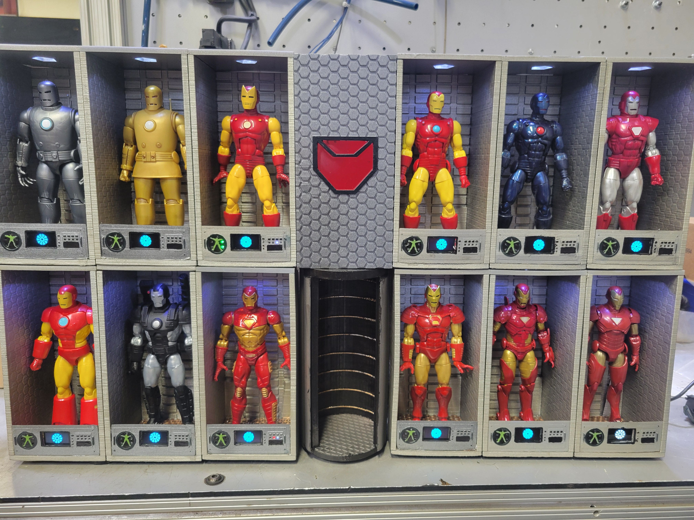

# Iron-Man-HoA




File collection for a Marvel Legends scaled Iron Man Hall of Armor.

Designed to hold 12 Iron Man figures, with a replica H.O.M.E.R. panel and Elevator/Launch tube.

Project is designed to be 3D printed easily.

## Demonstration

[(https://www.google.com/search?q=https://img.youtube.com/vi/XXk1AkZXeck/0.jpg)](https://www.youtube.com/watch%3Fv%3DXXk1AkZXeck)

[(https://www.google.com/search?q=https://img.youtube.com/vi/MWSStyxMDuw/0.jpg)](https://www.youtube.com/watch%3Fv%3DMWSStyxMDuw)

[(https://www.google.com/search?q=https://img.youtube.com/vi/htXjz3oLDX0/0.jpg)](https://www.youtube.com/watch%3Fv%3DhtXjz3oLDX0)

## 🚀 How it Works

The project functions as a physical wall clock where each armor bay represents one hour (1 through 12).

* **Master Control:** A Raspberry Pi 4 tracks the system time and enables a different Pico every hour via an "Enable" signal on GP18.
* **Bay Animation:** When enabled, the Pico runs diagnostics on the suit:
* **OLED Display:** Shows a rotating Arc Reactor. *Note: The rotation is intentionally jittery to simulate a diagnostic system lagging while processing data.*
* **Overhead Lighting:** Powers the bay's main spotlight via GP22.
* **Ambient Effects:** A central "HOMER" light pulses slowly using PWM to simulate a standby heartbeat.

## 🕰️ Clock Logic (Minutes Display)

Each bay features a custom LED clock interface to display the minutes:

* **Single Minutes (Binary):** A bay of four lights counts from 0 to 9 in binary.
* **Tens of Minutes (Circular):** Five lights arranged in a circle represent blocks of ten. One light turns on for each 10-minute interval (10, 20, 30, 40, and 50).

## 🛠️ Hardware & Shopping List

### Microcontrollers 
* **1x Raspberry Pi 4B:** The master controller.
* **12x Raspberry Pi Pico:** Local controllers for each bay.

### Components 
* **12x 0.96" OLED Modules:** 128x64 I2C Blue displays.
* **Adafruit LED Sequins:** Ruby Red, Emerald Green, Royal Blue, and Warm White.
* **Magnets:** 3mm D x 4mm H Neodymium magnets (glued to Marvel Legends' feet).
* **Flooring:** 16-Gauge Perforated Steel Sheet (24" x 24").
* **Wiring:** Twisted pair wires harvested from Cat 5 Network Cables.

## 📂 Software & Setup

### Raspberry Pi 4 Auto-start To ensure the clock starts automatically on boot:

Ensure the shebang line #!/usr/bin/env python3 is at the top of Suit_diag_master.py.

Make the script executable: 
  ```bash sudo chmod +x suit_diag_master.py ```

Open the Cron file: 
  ```bash sudo crontab -e ```

Add the following line to the bottom (update the path to your script): 
  ```bash @reboot sudo /home/Path/To/Script/suit_diag_master.py 2>&1 | tee -a /home/Path/To/Script/fault ```
*This creates a fault file in your directory. If the script doesn't run at boot, check this file.*

#### Pico Setup Each Pico runs CircuitPython. The board will automatically execute code.py in its onboard memory upon receiving power or an enable signal. Please note that different boards require different versions of CircuitPython; refer to [circuitpython.org](https://www.google.com/search?q=https://circuitpython.org/) for the correct version.

## 📜 Credits & Attributions

* **3D Design:** Building the 3D STL files was done using [TinkerCad](http://www.tinkercad.com).
* Original design/dimensions: [WayGroovy's "Iron Man Hall of Armor"](https://www.google.com/search?q=https://www.tinkercad.com/things/l37zKctDpl7-iron-man-hall-of-armor).
* Honeycomb side pattern: Remixed from [ines.lopez's "panel"](https://www.google.com/search?q=https://www.tinkercad.com/things/dchcW7EJQ0m-panel).
* Front Panel: Elements from [ZDP189's "NASA Apollo Mission Control Panels"](https://www.google.com/search?q=https://www.tinkercad.com/things/6omLFvvjeiZ-nasa-apollo-mission-control-panels).
* **Code & Assets:** * OLED tutorials by [educ8s.tv](http://educ8s.tv).
* Arc Reactor Vector art via [OnlineResize.club](https://www.google.com/search?q=https://onlineresize.club/2021-club.html).

## 🏗️ Future Plans 
* Integration of a sound module to trigger specific audio cues on the hour. 
* Integration with smart home assistants (Google Assistant, etc.).

## ⚖️ License
This project is intended for the Maker community. I am happy for individuals to sell their custom builds or improve the design, but commercial use by large-scale manufacturers is not authorized without a separate agreement.

*Built for the 6" Marvel Legends scale.*
